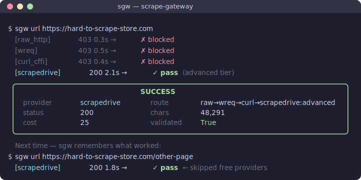

# scrape-gateway (`sgw`)

[](https://github.com/testy-cool/scrape-gateway/actions/workflows/ci.yml)
[](https://github.com/testy-cool/scrape-gateway/releases/latest)
[](LICENSE)

<p align="center">
  
</p>

One command, seven providers. Free ones tried first, paid ones only when needed. Domain memory skips the trial-and-error on repeat visits.

## Quick start

```bash
git clone https://github.com/testy-cool/scrape-gateway.git
cd scrape-gateway
pip install -e .
cp .env.example .env   # add API keys (optional — free providers work without any)

sgw selftest           # verify installation
sgw url https://example.com
```

## Commands

| Command | What it does |
|---|---|
| `sgw url <url>` | Scrape one page through the provider chain |
| `sgw extract <url>` | Pull structured data (JSON/CSV) from listing pages |
| `sgw detect <url>` | Recon — find repeated elements before extracting |
| `sgw links <url>` | Index all links on a page |
| `sgw follow <url> <n>` | Scrape link #n from a page |
| `sgw recipe <file>` | Replay a saved YAML workflow |
| `sgw run <file>` | Batch scrape URLs from a text file |
| `sgw meta <url>` | Extract OpenGraph metadata as JSON |
| `sgw history <url>` | Show scrape timeline and page changes |
| `sgw telemetry` | Inspect recent scrape reports |
| `sgw providers` | List all available providers |
| `sgw extensions` | Browse/install community extensions |
| `sgw selftest` | Verify installation with known-safe sites |

Full usage and examples: [docs/commands.md](docs/commands.md)

## Providers

7 built-in, 3 free. Router tries cheapest first.

| Provider | Cost | JS | Geo | Anti-bot |
|---|---|---|---|---|
| `raw_http` | free | no | no | none |
| `wreq` | free | no | no | TLS fingerprinting |
| `curl_cffi` | free | no | no | TLS fingerprinting |
| `scrapedrive` | paid | yes | yes | full (3 tiers) |
| `scrape_do` | paid | yes | yes | residential proxies |
| `scrapingbee` | paid | yes | yes | premium proxies |
| `scraperapi` | paid | yes | yes | premium proxies |

Add API keys in `.env` to enable paid providers. Without them, `sgw` uses free providers only.

## Extend it

Drop a `.py` file in `~/.config/scrape-gateway/providers/` or install from the registry with `sgw extensions`. See [docs/extensions.md](docs/extensions.md).

## Python API

```python
from scrape_gateway import ScrapeGateway, ScrapeRequest

gw = ScrapeGateway.from_config()
result = await gw.scrape(ScrapeRequest("https://example.com"))
```

More: [docs/python-api.md](docs/python-api.md)

## Docs

- [Commands](docs/commands.md) — full reference with examples
- [Architecture](docs/architecture.md) — how the router, cache, and memory work
- [Configuration](docs/configuration.md) — YAML config and `.env` setup
- [Extensions](docs/extensions.md) — writing custom providers
- [Python API](docs/python-api.md) — using sgw as a library
- [Providers](docs/providers.md) — provider details and API mapping
